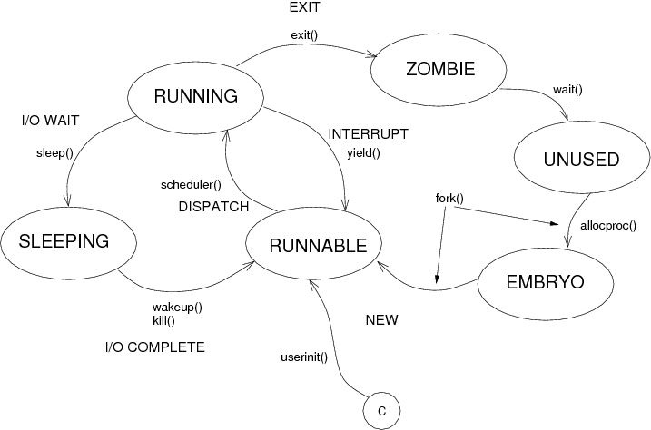

> Laboratorio 3 - Sistemas Operativos

# Planificador de procesos


## ¿Qué política de planificación utiliza xv6?

Políticas de planificación vistos en el teórico:

|Preemptive | Non Preemptive |
|:---       | :---|
|Multi-Level Feedback Queue     |Shortest Job First|
|Round Robin                    |First In, First Out|
|Shortest To Completion First   ||

En primer lugar, al leer el código del planificador original de xv6-riscv, inicialmente creímos que el sistema usaba un esquema de planificación **FIFO (First In, First Out)**. Esto se debe a que el código recorre la tabla de procesos (proc) en orden y asigna el próximo proceso disponible con el estado UNUSED (es decir, no utilizado) para ejecutarse, tal como podemos ver en la función allocproc():

```c
for(p  =  proc; p  <  &proc[NPROC]; p++) {

    acquire(&p->lock);

    if(p->state  ==  UNUSED) {

    goto  found;

    } else {

    release(&p->lock);

    }
}
```

En este fragmento, el planificador selecciona el primer proceso disponible de la lista y lo prepara para su ejecución. Este comportamiento inicialmente nos hizo pensar que el scheduling seguía un esquema de FIFO, donde los procesos entran en la cola de ejecución en el orden en que se crean, y luego salen en ese mismo orden.

Sin embargo, al analizar el código más a fondo, encontramos evidencia de que no es simplemente FIFO, sino que también incluye interrupciones de temporizador que permiten cambiar de proceso periódicamente. Esto nos llevó a concluir que el sistema sigue un esquema de Round Robin, una variante del FIFO donde cada proceso obtiene una porción de tiempo de CPU, y si no termina dentro de ese tiempo, es interrumpido y otro proceso es ejecutado.

La clave de esta conclusión está dentro de la función timerinit():

```c
void
timerinit()
{
  ...
  int interval = 1000000; // cycles; about 1/10th second in qemu.
  *(uint64*)CLINT_MTIMECMP(id) = *(uint64*)CLINT_MTIME + interval;

  uint64 *scratch = &timer_scratch[id][0];
  scratch[3] = CLINT_MTIMECMP(id);
  scratch[4] = interval;
  w_mscratch((uint64)scratch);

  // set the machine-mode trap handler.
  w_mtvec((uint64)timervec);

  // enable machine-mode interrupts.
  w_mstatus(r_mstatus() | MSTATUS_MIE);

  // enable machine-mode timer interrupts.
  w_mie(r_mie() | MIE_MTIE);
}
```

Esta función es llamada en el arranque del kernel, por el archivo **start.c** como se muestra en el siguiente código:
```c
void main();
void timerinit();
...
```

En esta función:

* Se establece un temporizador con un intervalo de aproximadamente 1/10 de segundo en QEMU, lo que genera interrupciones periódicas.
* Estas interrupciones aseguran que el planificador tenga la oportunidad de interrumpir el proceso en ejecución y evaluar si debe cambiar a otro proceso, basándose en el concepto de quantum, característico del algoritmo Round Robin.
El temporizador genera interrupciones en intervalos regulares, y cuando llega la interrupción, el sistema tiene la posibilidad de alternar entre procesos. Esto introduce la característica clave del Round Robin, donde los procesos se ejecutan por turnos de manera equitativa, lo que difiere de un FIFO puro.


## ¿Cúales son los estados en los que un proceso puede permanecer en xv6-riscv y qué los hace cambiar de estado?

En el sistema operativo xv6-riscv, los procesos pasan por varios estados a lo largo de su ciclo de vida. Estos estados están representados por la enumeración enum procstate, y son los siguientes:

```c
enum procstate { UNUSED, USED, SLEEPING, RUNNABLE, RUNNING, ZOMBIE };
```
A continuación, se describen los estados y los eventos que hacen que un proceso cambie de estado, acompañados de los fragmentos de código correspondientes.

### UNUSED (No Usado)
El estado inicial de todos los procesos en la tabla de procesos es UNUSED, lo que indica que no están siendo utilizados. En la función procinit(), la tabla de procesos se inicializa con todos los procesos en estado UNUSED:
```c
void procinit(void) {
    struct proc *p;
    for(p = proc; p < &proc[NPROC]; p++) {
        initlock(&p->lock, "proc");
        p->state = UNUSED;  // Inicialización en UNUSED
        p->kstack = KSTACK((int) (p - proc));
    }
}
```
Un proceso cambia de UNUSED a USED cuando se asigna una nueva estructura de proceso a través de la función allocproc().

### USED (Usado)
Cuando se crea un nuevo proceso, se le asigna una entrada en la tabla de procesos y su estado cambia a USED. Esto sucede en la función allocproc():
```c
p->pid = allocpid();
p->state = USED;  // El proceso ahora está en USED
```
En este estado, el proceso está configurado pero aún no está listo para ejecutarse, hasta que se complete su configuración y pase a RUNNABLE.

### RUNNABLE (Listo para Ejecutarse)
Un proceso pasa al estado RUNNABLE cuando está completamente inicializado y listo para ser programado en la CPU. Esto sucede en varios lugares del código, como en userinit() (que crea el primer proceso de usuario) y en fork() (que crea un proceso hijo). Aquí está el ejemplo de userinit():
```c
void userinit(void) {
    struct proc *p;
    p = allocproc();
    // Configuración del proceso...
    p->state = RUNNABLE;  // El proceso está listo para ejecutarse
    release(&p->lock);
}
```
Asimismo, en la implementación de fork(), el proceso hijo se pone en estado RUNNABLE:
```c
np->state = RUNNABLE;  // Proceso hijo listo para ejecutarse
```
El estado RUNNABLE indica que el proceso puede ser seleccionado por el planificador para ejecutarse.

### RUNNING (En Ejecución)
Cuando el planificador selecciona un proceso para ejecutarse, este pasa al estado RUNNING. Esto ocurre en la función scheduler():
```c
if(p->state == RUNNABLE) {
    p->state = RUNNING;  // Proceso pasa a estado de ejecución
    c->proc = p;
    swtch(&c->context, &p->context);
}
```
Un proceso se mantiene en este estado mientras tiene tiempo de CPU asignado. Cuando termina su quantum o cede la CPU, su estado cambia a RUNNABLE.

### SLEEPING (Durmiendo)
Un proceso puede pasar al estado SLEEPING si está esperando que ocurra un evento o condición. Esto sucede en la función sleep():
```c
void sleep(void *chan, struct spinlock *lk) {
    struct proc *p = myproc();
    acquire(&p->lock);
    release(lk);

    p->chan = chan;
    p->state = SLEEPING;  // El proceso está dormido
    sched();

    p->chan = 0;
    release(&p->lock);
}
```
El proceso permanecerá en estado SLEEPING hasta que el evento o condición que está esperando ocurra y se llame a wakeup() para despertarlo.

### ZOMBIE (Zombi)
Cuando un proceso termina su ejecución, pasa al estado ZOMBIE. Esto indica que el proceso ha finalizado pero aún no ha sido recolectado por su proceso padre (a través de una llamada a wait()). El cambio a estado ZOMBIE ocurre en la función exit():
```c
void exit(int status) {
    struct proc *p = myproc();
    // Código para cerrar archivos y manejar procesos hijos...

    p->xstate = status;
    p->state = ZOMBIE;  // Proceso pasa a ZOMBIE
    sched();
}
```
El proceso permanecerá en estado ZOMBIE hasta que su proceso padre llame a wait() para recoger su estado de salida.

### Otras Funciones Relevantes
* wakeup(): Despierta los procesos en estado SLEEPING, poniéndolos en estado RUNNABLE:
```c
if(p->state == SLEEPING && p->chan == chan) {
    p->state = RUNNABLE;  // Despierta al proceso
}
```
* kill(): Si un proceso está dormido cuando se le envía una señal de terminación (kill()), se cambia su estado de SLEEPING a RUNNABLE:
```c
if(p->state == SLEEPING){
    p->state = RUNNABLE;  // Forzar a RUNNABLE si está dormido
}
```
* freeproc(): Libera los recursos de un proceso y lo devuelve al estado UNUSED:
```c
p->state = UNUSED;  // El proceso es liberado y vuelve a UNUSED
```

A continuación un diagrama de los cambios de estado posibles de un proceso:


<https://ucema.edu.ar/u/jmc/siop/U1/xv6_referencias>